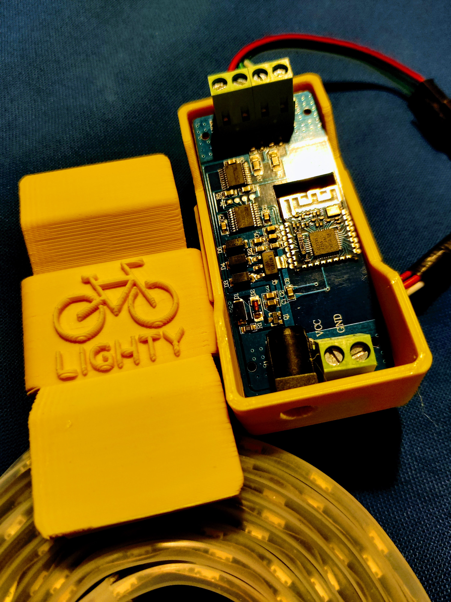

# 💡 LightyUp 🦄

> One app to control them all, and in the brightness bind them

## ⚡ TL;DR

A react-powered PWA which allows BLE LED-strips control from Google Chrome

## 🚴 The story

[Lighty](https://lighty.bike/) is a bicycle-fanatic's company aimed at promoting safety and fun amongst two-wheeled enthusiasts.

One of the products offered by Lighty is a Bluetooth remote-controlled LED strip, which uses a usually low-quality Adnroid / iOS app as a user-interface.

Lighty's very own Ophélie asked me if I could do better, so hackity hack, hack away!

***

I retro-engineered the (admittedly) simple communication protocol using Wireshark and my smartphone as a log source, used the native [Web Bluetooth API](https://developer.mozilla.org/en-US/docs/Web/API/Web_Bluetooth_API) to connect to the BLE device, and whisked everything together in a React app with a nice layer of TailwindCSS.

Voilà!

***

I also modeled and 3D-printed a Lighty-branded box for the BLE controller, as the original plastic one was boring and cumbersome.
Just because I caould, right?

## 📸 Smile!

## 🎥 And... action

[LightyUp in action](docs/assets/VID_20201130_182747.mp4)
***
[Another color scheme perhaps ?](docs/assets/VID_20201130_182908.mp4)
